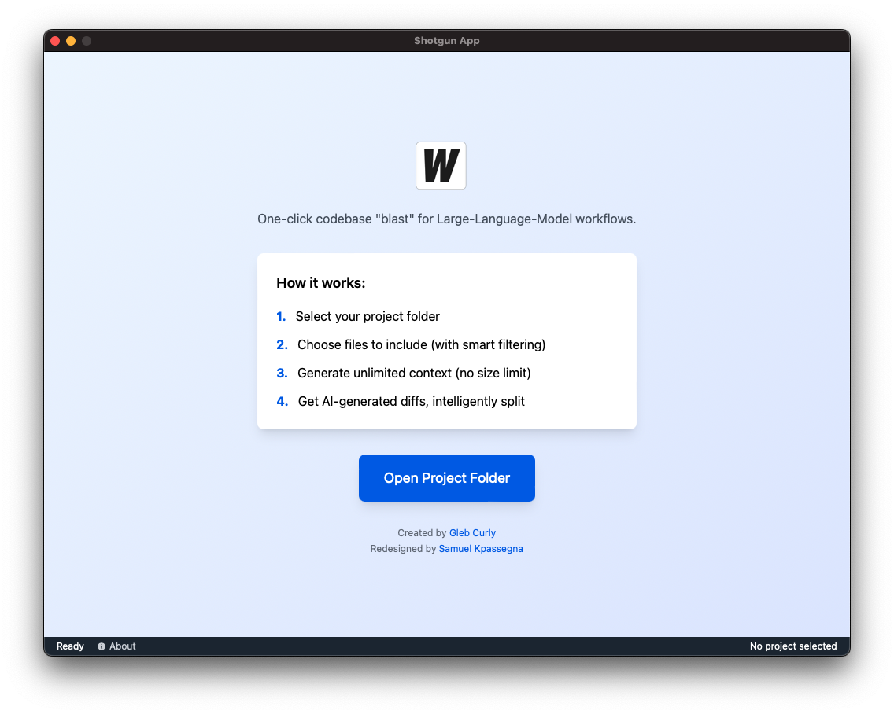

<div align="center">



# Shotgun Code

**Modern desktop app for generating massive codebase snapshots and intelligently splitting diffs for AI coding assistants.**

[](LICENSE.md)
[](https://golang.org/)
[](https://wails.io/)
[](https://vuejs.org/)

[Download Latest Release](https://github.com/skpassegna/shotgun_code/releases) • [Documentation](#documentation) • [Contributing](CONTRIBUTING.md)

</div>

---

## What is Shotgun Code?

**Tired of AI coding assistants cutting off context, missing files, and giving incomplete responses?**

Shotgun Code solves this by generating **unlimited-size codebase snapshots** for AI assistants like Cursor, Windsurf, ChatGPT, Claude, and Gemini.

### The Problem
- AI assistants have context limits (often 10MB or less)
- Manual file selection is tedious and error-prone
- Large diffs are hard to apply in one go
- Copy-pasting between tools breaks your flow

### The Solution
 **Unlimited Context** – No size limits! Generate contexts as large as needed
 **Smart File Selection** – VSCode-style tree with search, filtering, and tri-state checkboxes
 **Direct LLM Integration** – Built-in support for Google Gemini, OpenAI, Anthropic, and custom APIs
 **Intelligent Diff Splitting** – Advanced bin-packing algorithm splits large diffs optimally
 **Real-time Updates** – File watching with hot reload when your codebase changes
 **Keyboard Shortcuts** – Navigate efficiently with VSCode-style shortcuts
 **Token Estimation** – Real-time token counting and cost calculation

**Perfect for:** Python, JavaScript, TypeScript, Go, and any dynamically-typed language

Shotgun Code trades surgical, single-file prompts for a **"whole-repository blast"** – hence the name.

---

## Quick Start

### Download & Install

**[Download the latest release](https://github.com/skpassegna/shotgun_code/releases)**

Choose the version for your operating system:
- **Windows:** `shotgun_code-windows-amd64.exe`
- **macOS:** `shotgun_code-darwin-arm64.app.zip` (Apple Silicon) or `shotgun_code-darwin-amd64` (Intel)
- **Linux:** `shotgun_code-linux-amd64`

### First Run

1. **Launch the app** – Double-click the downloaded file
2. **Select your project folder** – Choose the root directory of your codebase
3. **Select files** – Use the file tree to choose which files to include
4. **Choose a mode** – Development, Architecture, Debug, or Tasks
5. **Describe your task** – Tell the AI what you want to accomplish
6. **Execute** – Use built-in LLM integration or copy-paste to external tools
7. **Apply patches** – Copy the generated code back to your editor

That's it! You're ready to blast your entire codebase into an AI's context window.

---

## ✨ Key Features

### Smart File Selection
- **VSCode-style file tree** with tri-state checkboxes
- **Search & filter** – Find files instantly with Ctrl+F
- **Smart exclusions** – Respects `.gitignore`, custom patterns, and manual exclusions
- **Bulk actions** – Select all, invert selection, expand/collapse all
- **File metadata** – See file sizes and types at a glance

### Direct LLM Integration
- **Google Gemini** – Best for large contexts (2M tokens), 25 free queries/day
- **OpenAI GPT** – GPT-4, GPT-4 Turbo, and GPT-3.5
- **Anthropic Claude** – Claude 3 Opus, Sonnet, and Haiku
- **Custom APIs** – Connect to any OpenAI-compatible endpoint
- **Token estimation** – Real-time cost calculation before execution

### Intelligent Diff Splitting
- **Advanced bin-packing algorithm** – Optimally splits large diffs
- **Configurable size** – Set lines per split (default: 500)
- **Preview splits** – See how your diff will be divided
- **Copy individual splits** – Apply patches one at a time

### Modern UX/UI
- **9-screen workflow** – Guided onboarding-style navigation
- **Keyboard shortcuts** – Ctrl+F, Ctrl+A, Ctrl+Enter, Escape, and more
- **Toast notifications** – Real-time feedback for all operations
- **Job queue status** – Monitor background tasks
- **Dark mode** – Professional VSCode-inspired design

### Advanced Features
- **Unlimited context** – No 10MB limit! Generate contexts as large as needed
- **File watching** – Real-time updates when your codebase changes
- **Multi-tier clipboard** – WSL→Wails→Browser fallback for reliable copy
- **Session persistence** – Save and restore your workflow state
- **Cross-platform** – Windows, macOS, Linux with native performance

---

## How to Use

Shotgun Code uses a modern, 9-screen workflow inspired by VSCode:

###  Welcome
- Quick overview and getting started guide
- Recent projects (coming soon)

### Folder Selection
- Select your project root directory
- Native OS folder picker
- Remembers recent selections

### File Selection
- **Enhanced file tree** with tri-state checkboxes
- **Search** – Press Ctrl+F to find files instantly
- **Bulk actions** – Ctrl+A (select all), Ctrl+I (invert), Ctrl+E (expand all)
- **Smart badges** – See which files are excluded by `.gitignore` or custom rules
- **Real-time updates** – File watcher refreshes tree when files change

### Mode Selection
Choose your workflow mode:
- **Development** – Generate code, implement features, fix bugs
- **Architecture** – Design systems, plan refactors, create diagrams
- **Debug** – Analyze errors, trace issues, suggest fixes
- **Tasks** – Break down work, create task lists, plan sprints

###  Task Description
- Describe what you want to accomplish
- Add custom rules and constraints
- Template suggestions based on selected mode
- Keyboard shortcuts: Ctrl+S (save), Ctrl+Enter (continue)

### Prompt Review
- **Preview** – See the generated codebase snapshot
- **Token count** – Real-time estimation and cost calculation
- **Edit** – Make last-minute adjustments
- **Copy** – One-click copy to clipboard

### Execution
Choose how to execute:
- **Direct API** – Use built-in LLM integration (Gemini, OpenAI, Claude, Custom)
- **Manual** – Copy prompt and paste into external tool
- **Progress tracking** – Monitor background jobs in real-time

### Split Diff (if needed)
- **Intelligent splitting** – Advanced bin-packing algorithm
- **Configure size** – Set lines per split (default: 500)
- **Preview** – See how your diff will be divided
- **Copy splits** – Apply patches one at a time

### Apply Patch
- **Review** – Preview changes before applying
- **Copy** – Easy integration with Cursor, Windsurf, or other tools
- **Summary** – See what was accomplished

---

##  Keyboard Shortcuts

Master these shortcuts for a 10x faster workflow:

### Global Navigation
| Shortcut | Action |
|----------|--------|
| `Ctrl+Enter` | Continue to next screen |
| `Escape` | Go back to previous screen |
| `Ctrl+H` | Return to home screen |

### File Selection Screen
| Shortcut | Action |
|----------|--------|
| `Ctrl+F` | Focus search box |
| `Ctrl+A` | Select all files |
| `Ctrl+I` | Invert selection |
| `Ctrl+E` | Expand all folders |
| `Ctrl+Shift+E` | Collapse all folders |
| `Escape` | Clear search (when search is focused) |

### Text Editing Screens
| Shortcut | Action |
|----------|--------|
| `Ctrl+S` | Save draft |
| `Ctrl+Enter` | Submit and continue |
| `Ctrl+K` | Clear text |

---

##  Use Cases

| Scenario | How Shotgun Code Helps |
|----------|------------------------|
| ** Bulk Bug Fixing** | "Fix X across 12 files" – LLM sees all usages with unlimited context |
| ** Large Refactoring** | Get full context and intelligently-split patches for complex refactors |
| ** Onboarding** | Generate a single, searchable context file for new team members |
| ** Documentation** | LLM can iterate over full source to generate docs/tests |
| ** Code Review** | Provide complete context for thorough AI-assisted reviews |
| ** Architecture Planning** | Analyze entire codebase structure for system design decisions |

---

## Best Practices

### File Selection
- **Use search** – Press Ctrl+F to quickly find files
- **Leverage .gitignore** – Automatically excludes build artifacts and dependencies
- **Custom ignore patterns** – Add patterns to `ignore.glob` for project-specific exclusions
- **Trim the noise** – Exclude lock files, vendored libs, generated assets, media files
- **Check file sizes** – Large binary files are shown with size badges

### Prompting
- **Be specific** – Clear task descriptions get better results
- **Use custom rules** – Add constraints, coding standards, or preferences
- **Choose the right mode** – Development/Architecture/Debug/Tasks modes provide context
- **Ask for diffs** – Request patch format for easier application
- **Iterate** – Generate → Review → Execute → Refine → Repeat

### LLM Integration
- **Google Gemini** – Best for large contexts (2M tokens), 25 free queries/day
- **Check token count** – Estimate cost before executing expensive prompts
- **Temperature settings** – Lower (0.3-0.5) for code, higher (0.7-0.9) for creative tasks
- **Model selection** – Use flash models for speed, pro models for complex reasoning

### Diff Management
- **Split large diffs** – Use intelligent splitting for diffs >500 lines
- **Apply incrementally** – Test each split before applying the next
- **Review before applying** – Always check generated patches
- **Use version control** – Commit before applying large patches

---

## Troubleshooting

### Common Issues

**File tree not loading**
- Check folder permissions
- Try a different folder
- Restart the app

**Clipboard copy fails**
- Try manual copy-paste mode
- Check clipboard permissions
- On WSL, ensure `clip.exe` is accessible

**LLM API call fails**
- Verify API key is correct
- Check internet connection
- Review error message in job queue

**Slow performance**
- Exclude large directories (node_modules, .git, build)
- Reduce context size by excluding more files
- Check background jobs in job queue

### Getting Help

-  **Documentation** – See [CONTRIBUTING.md](CONTRIBUTING.md) for development setup
-  **Report bugs** – [GitHub Issues](https://github.com/skpassegna/shotgun_code/issues)
-  **Discussions** – [GitHub Discussions](https://github.com/skpassegna/shotgun_code/discussions)

---

##  Development

Want to contribute or build from source? See [CONTRIBUTING.md](CONTRIBUTING.md) for detailed instructions.

### Quick Development Setup

```bash
# Clone the repository
git clone https://github.com/skpassegna/shotgun_code.git
cd shotgun_code

# Install dependencies
go mod tidy
cd frontend && npm install && cd ..

# Run in development mode
wails dev

# Build for production
wails build
```

### Technology Stack

**Backend:** Go, Wails v2, fsnotify, go-gitignore
**Frontend:** Vue.js 3, Pinia, Tailwind CSS, Vite
**Features:** Async job queue, file watching, LLM integration, intelligent diff splitting

---

##  Contributing

We welcome contributions! Whether you're fixing bugs, adding features, or improving documentation, your help is appreciated.

**Ways to Contribute:**
-  [Report bugs](https://github.com/skpassegna/shotgun_code/issues/new?template=bug_report.md)
- [Request features](https://github.com/skpassegna/shotgun_code/issues/new?template=feature_request.md)
- Improve documentation
- Submit pull requests
- Star the repository if you find it useful!

See [CONTRIBUTING.md](CONTRIBUTING.md) for detailed guidelines.

---

## 👥 Credits

### Original Creator
**Gleb Curly** ([@glebkudr](https://github.com/glebkudr)) – Project creator and original developer
- Go backend with Wails framework
- File system operations and context generation
- Diff splitting algorithm
- Original Vue.js frontend

### UX/UI Redesign
**Samuel Kpassegna** ([@skpassegna](https://github.com/skpassegna)) – Modern VSCode-style interface
- Complete UX/UI redesign
- Multi-screen workflow (9 screens)
- Enhanced file tree with search and filtering
- Modern component architecture
- Keyboard shortcuts and toast notifications

See [ATTRIBUTION.md](ATTRIBUTION.md) for full credits and acknowledgments.

---

## License

MIT license – see [LICENSE.md](LICENSE.md) for details.

---

<div align="center">

**Shotgun Code** – Load, aim, blast your code straight into the mind of an LLM.

[⬆ Back to Top](#shotgun-code)

</div>
